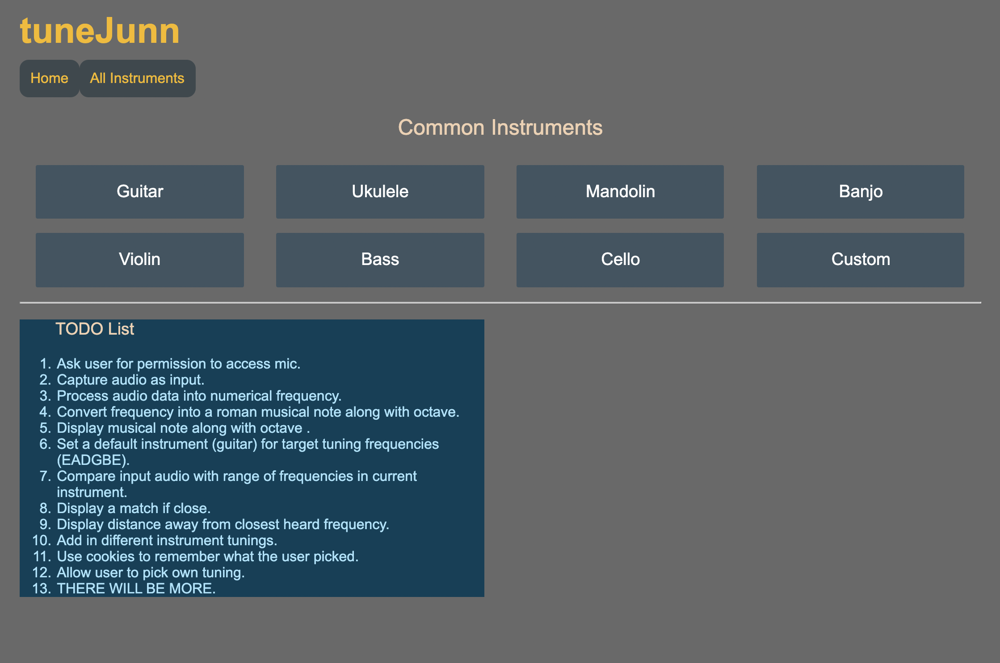

# TuneJunn

Lightweight web app string instrument tuner built with Angular.js

## About

Currently in **very early** production. Hoping to get incremental progress on this day by day.

## TODOs

1. Ask user for permission to access mic.
2. Capture audio as input.
3. Process audio data into numerical frequency.
4. Convert frequency into a roman musical note along with octave.
5. Display musical note along with octave .
6. Set a default instrument (guitar) for target tuning frequencies (EADGBE).
7. Compare input audio with range of frequencies in current instrument.
8. Display a match if close.
9. Display distance away from closest heard frequency.
10. Add in different instrument tunings.
11. Use cookies to remember what the user picked.
12. Allow user to pick own tuning.
13. THERE WILL BE MORE.

