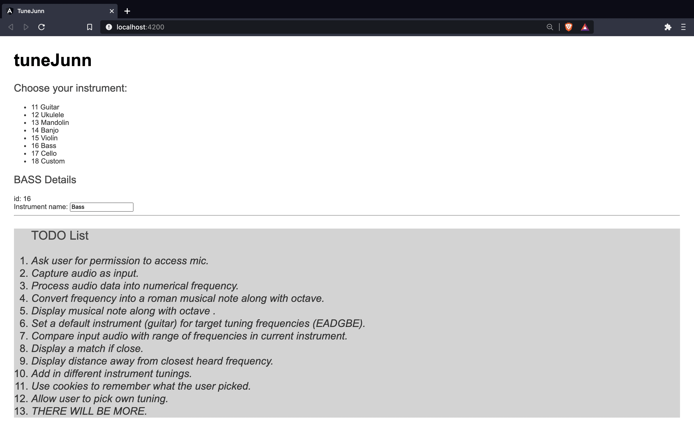
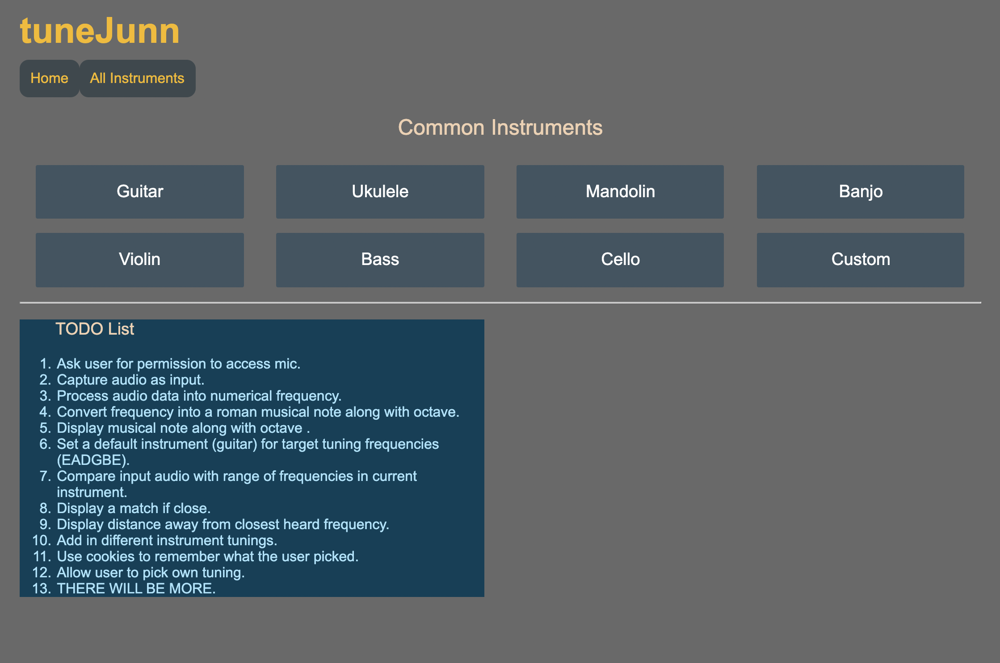
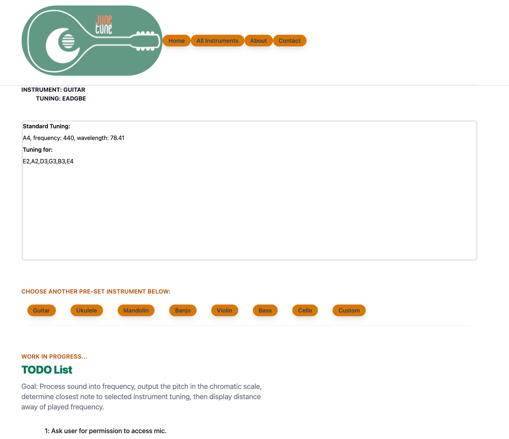

# TuneJunn

Lightweight web app instrument tuner built with Angular.js

## About

Currently in **very early** production. Hoping to get incremental progress on this and learn more about each technology I apply to it.

So far, Angular.js and TailwindCSS are the bulk of the learning for this project.

## Progress

May 4, 2021 - rev 2

I implemented TailwindCSS to make the site a little prettier to look at. I can't tell if I like TailwindCSS yet, but so far it has been powerful. I will likely change my color scheme.

I am navigating object oriented programming practices using Angular.JS. To practice Typescript/Angular OOP, I am writing classes for the equal tempered music scale to learn about typing/interfaces. I would like to be able build upon that to create other music applications.

Right now, I have the formula for finding the frequency of notes relative to a base note. 

fn = f0 * (a)n

Credits to [Michigan Technological University](https://pages.mtu.edu/~suits/NoteFreqCalcs.html) for the information. 

I've coded in finding the frequency of the note if given the amount of half steps away from the desired musical note. I need to implement a way to determine half steps. I am thinking I will add a data structure to store all equal tempered scale notations, frequencies, and wave lengths and create getters and setters to make that easier for myself. 

Note: I will eventually move all this stuff to a blog and provide more useful information at another time.

## TODOs

1. Ask user for permission to access mic.
2. Capture audio as input.
3. Process audio data into numerical frequency.
4. Convert frequency into a roman musical note along with octave.
5. Display musical note along with octave .
6. Set a default instrument (guitar) for target tuning frequencies (EADGBE).
7. Compare input audio with range of frequencies in current instrument.
8. Display a match if close.
9. Display distance away from closest heard frequency.
10. Add in different instrument tunings.
11. Use cookies to remember what the user picked.
12. Allow user to pick own tuning.
13. THERE WILL BE MORE.

